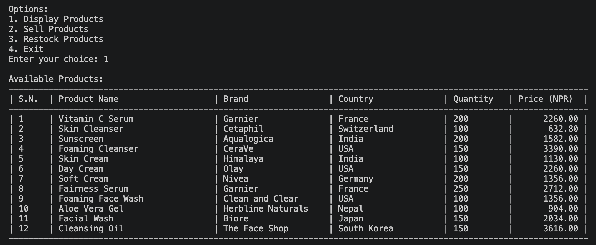
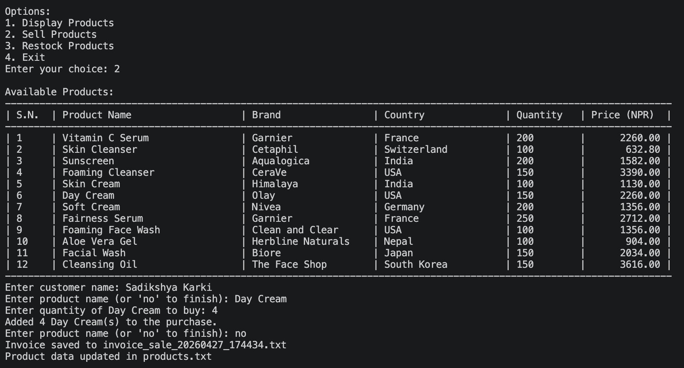
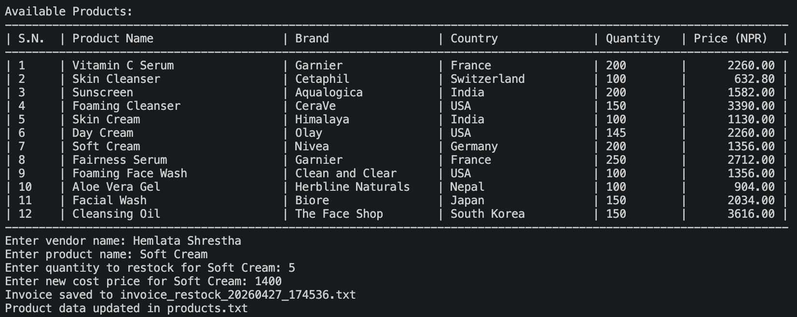
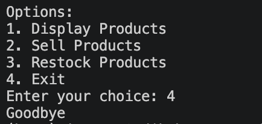
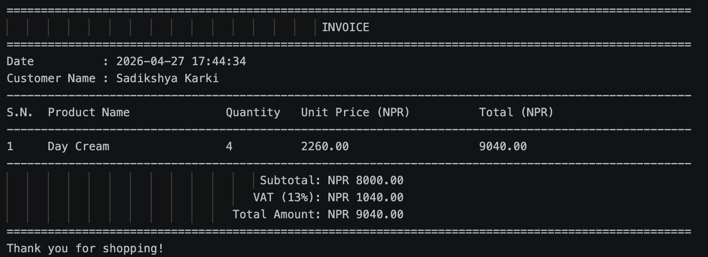
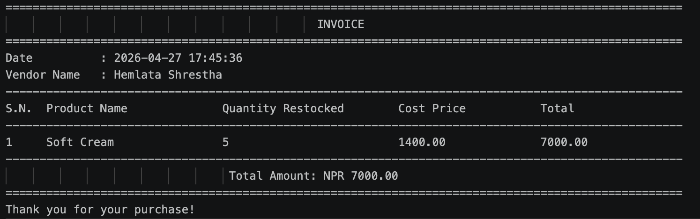

# 🧴 Skin Care Product Inventory Management System

A **Python-based console application** that helps manage skincare product inventory, process sales, and handle restocking efficiently.  
The system updates stock in real time and automatically generates invoices for customer purchases.

---

## 🚀 Features

### 📦 View Available Products
- Displays all available skincare products
- Shows:
  - Product Name
  - Brand
  - Country of Origin
  - Quantity
  - Selling Price
- Selling price includes **200% markup + 13% VAT**

---

### 🛒 Sales Processing
- Allows customers to purchase products
- Records customer name and purchased items
- Generates itemized invoice automatically
- Applies promotion: **Buy 3 → Get 1 Free**
- Updates stock after each sale

---

### 🔄 Inventory Restocking
- Restock products from vendors
- Updates product quantities in the system
- Maintains accurate inventory levels

---

### 💾 Persistent Data Storage
- Data stored in `products.txt`
- No database required
- Automatically saves updates
- Loads latest data on every run

---

## 📁 Project Structure

```
skin-care-system/
│
├── main.py          # Main program (menu system)
├── read.py          # Reads product data
├── write.py         # Generates invoices
├── operation.py     # Core logic and calculations
├── products.txt     # Product database
```

---

## ▶️ How to Run

1. Open terminal in project folder  
2. Run:

```bash
python main.py
```

3. Choose from menu:

- View products
- Sell products
- Restock products
- Exit

---

## 📄 Product File Format (`products.txt`)

Each product is stored as:

```
ProductName,Brand,Quantity,CostPrice,Country
```

### Example:

```
Vitamin C Serum,Garnier,200,1000.0,France
Skin Cleanser,Cetaphil,100,280.0,Switzerland
```

---

## 🧠 Price Calculation

- 200% markup on cost price  
- 13% VAT added  

```python
def calculate_selling_price(cost_price):
    return cost_price * 2 * 1.13
```

---

## 🎁 Promotional Offer

- Buy 3 items → Get 1 free  

```python
free_items = quantity_sold // 3
total_items = quantity_sold + free_items
```

---

## 🧾 Sample Invoice

```
==================================================
                    INVOICE
==================================================
Customer Name : John Doe

Product        Qty     Price     Total
Sunscreen      3       1580      4740

Subtotal: 4194.69
VAT (13%): 545.31
Total: 4740
==================================================
Thank you for shopping!
```

---

## ⚠️ Limitations

- Console-based (no GUI)
- Uses text file instead of database
- No user authentication

---


## 📸 Preview

### Display Products


### Sell Products


### Restock Products


### Exit


### Sale Invoice


### Restock Invoice


---

## 🧑‍💻 Author
**Sadikshya Karki**